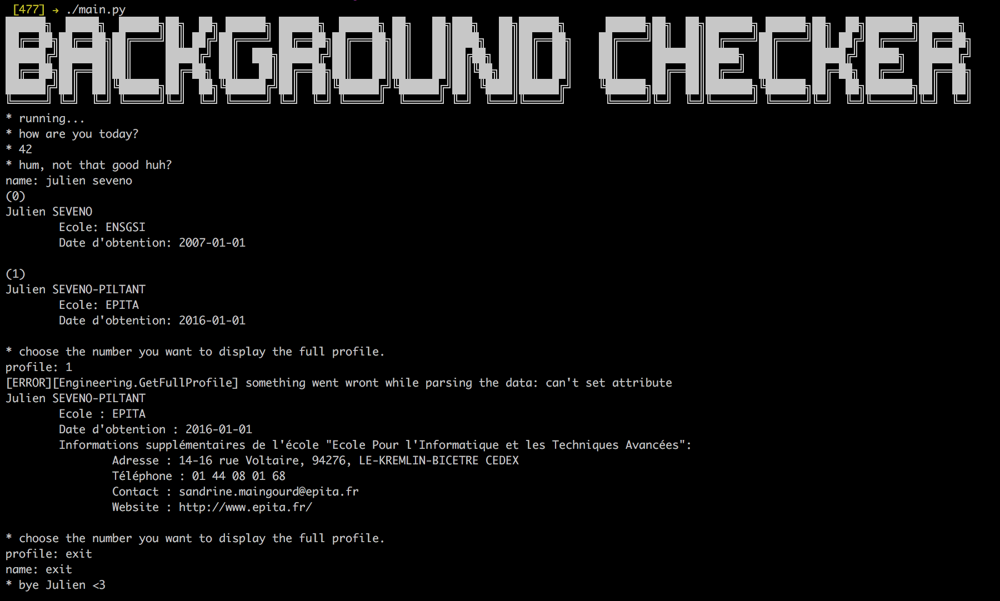

# Background Checker

> A command line tool to background check people.

```
██████╗  █████╗  ██████╗██╗  ██╗ ██████╗ ██████╗  ██████╗ ██╗   ██╗███╗   ██╗██████╗      ██████╗██╗  ██╗███████╗ ██████╗██╗  ██╗███████╗██████╗
██╔══██╗██╔══██╗██╔════╝██║ ██╔╝██╔════╝ ██╔══██╗██╔═══██╗██║   ██║████╗  ██║██╔══██╗    ██╔════╝██║  ██║██╔════╝██╔════╝██║ ██╔╝██╔════╝██╔══██╗
██████╔╝███████║██║     █████╔╝ ██║  ███╗██████╔╝██║   ██║██║   ██║██╔██╗ ██║██║  ██║    ██║     ███████║█████╗  ██║     █████╔╝ █████╗  ██████╔╝
██╔══██╗██╔══██║██║     ██╔═██╗ ██║   ██║██╔══██╗██║   ██║██║   ██║██║╚██╗██║██║  ██║    ██║     ██╔══██║██╔══╝  ██║     ██╔═██╗ ██╔══╝  ██╔══██╗
██████╔╝██║  ██║╚██████╗██║  ██╗╚██████╔╝██║  ██║╚██████╔╝╚██████╔╝██║ ╚████║██████╔╝    ╚██████╗██║  ██║███████╗╚██████╗██║  ██╗███████╗██║  ██║
╚═════╝ ╚═╝  ╚═╝ ╚═════╝╚═╝  ╚═╝ ╚═════╝ ╚═╝  ╚═╝ ╚═════╝  ╚═════╝ ╚═╝  ╚═══╝╚═════╝      ╚═════╝╚═╝  ╚═╝╚══════╝ ╚═════╝╚═╝  ╚═╝╚══════╝╚═╝  ╚═╝
```

## About

This program is being developed in the scope of **OpenSource Intelligence** (OSINT).

OSINT makes use of data available on the Internet in order to gather information about companies, people, entities...

It is particularly used by the following actors:
- governments (political environment, war zones...)
- companies (background checking, criminal records, business intelligence...)
- hackers and pentesters (to prepare hacks, information system architectures...)


This tool is especially dedicated to companies and human resources departments to help them check that candidates
are not lying about their educational background and resume.

## Installation

OS X, Linux & Windows:
```sh
git clone https://github.com/Bornlex/BackgroundChecker
```

I developed it using **Python 3.6**. I did not test it on many versions, but it should work with any 3.* versions.

It requires the following non-core modules:
- requests

You can install it through .

## Usage

To start the tool, just run:
```sh
./main.py
```

Then enter the name you want to look for.

To exit the tool or go one step back, use the `exit` command.

## Development

Any contribution is welcome.

To contribute:
1. Fork the project
2. Create a new branch (`git checkout -b feature/branch_name`)
3. Commit your changes(`git commit -am 'Add some amazing features'`)
4. Push to the branch (`git push origin feature/branch_name`)
5. Create a new Pull Request

There is no automated tests for now. But if the program is running and you can actually get some results, that probably means that everything works fine...

## TODO

- Create a UI
- Create automated tests
- Develop new data sources for business schools
- Save results and flush them to a file
- Keep history of commands typed
- Autocompletion

## What it look like

It is pretty raw as the development just started.

